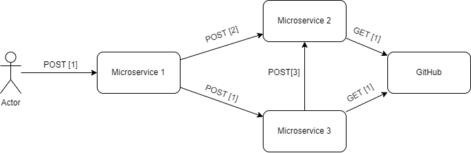

# RESTSense Demo
This repository contains a demo showcasing a concrete use case of the RESTSense framework. These use cases are detailed in the subsequent sections.

## Telemetry Powered Capacity Analysis
We want to test the capability of RESTSense to contribute to the process of Capacity Analysis. The goal of this showcase is to automatically infer the inputs required for the capacity analysis based on telemetry data. To do that, we have prepared a test architecture that consists of a set of microservices that are deployed using docker-compose.

### TestBed
The TestBed is a set of microservices that are deployed using docker-compose. The TestBed is composed of the following three microservices, developped based on the [Generic API Requester](https://github.com/alesancor1/api-requester) project:
* **Microservice 1**: Exposes the API, thus being the entrypoint of the architecture.
* **Microservice 2**: Receives the request from Microservice 1 and forwards it based on the request's body.
* **Microservice 3**: Receives the request from Microservice 2 and Microservice 1 and forwards it based on the request's body.

Once deployed, we send a request to the entrypoint service (Microservice 1). In the request body, we introduce a model of the requests that should be made within the architecture. The model follows the following structure:

```json
[
    {
        "url": "http://microservice-two/api/v1/request", // Microservice 1 -> Microservice 2
        "method": "POST",
        "body": {
            "url": "ANOTHER_URL", // Microservice 2 -> ANOTHER_URL
            "body": { "..." },
            "headers": { "..." }
        }
    }
]
```

This way, we can define a chain of requests that will be made within the TestBed. The TestBed will then make the requests and return the responses to the client. The chain of requests used in this showcase can be found in the [request.json](testbed/request.json) file. 

> Note that <GH_TOKEN> in the request.json file should be replaced by a valid GitHub token.

This diagram shows the architecture of the testbed, taking into account the requests defined in the [request.json](testbed/request.json) file:



Each of the services in the TestBed is instrumented with the [RESTSense Agent](https://github.com/restsense/agent) that sends the telemetry data to the [RESTSense Collector](https://github.com/restsense/collector), which is in charge of persisting it to MongoDB. Then, a CSV file is directly generated from MongoDB by using the [MongoDB Compass](https://www.mongodb.com/products/compass) tool.

### Result
The capacity analysis process is performed in the [capacity-analysis.ipynb](testbed/capacity-analysis.ipynb) notebook. The notebook details the process of inferring the inputs required for the capacity analysis based on the telemetry data, and performs the analysis afterwards. 

The results show that RESTSense successfully infers the inputs required for the capacity analysis based on the telemetry data and thus, contributes to the automation of the capacity analysis process.